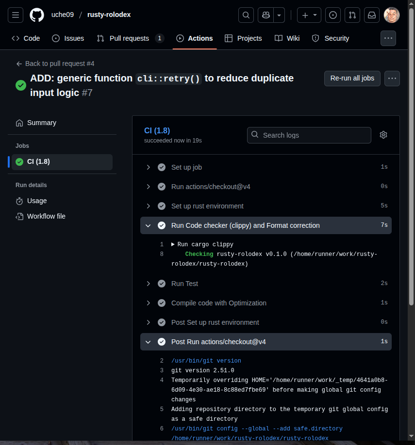

# RUSTY-ROLODEX WEEKLY WALKTHROUGH

## TABLE OF CONTENTS
* [**Week 1 Walkthrough**](#rusty-rolodex---week-1-walkthrough)
    - [Initial Project Setup](#1-initial-project-setup)  
    - [Setting up project structure](#2-Setting-up-project-structure)
    - [Setup store.rs](#3-setup-storers)
    - [Setup domain.rs](#4-setup-domainrs)
    - [Program flow (main.rs)](#5-program-flow-mainrs)
    - [Interface (cli.rs)](#6-interface-clirs)
    - [Validation (validation.rs)](#7-validation-validationrs)
    - [Verification & Test](#8-verification--test)

* [**Week 2 Walkthrough**](#rusty-rolodex---week-2-walkthrough)
    - [Persistent Memory](#persistent-memory)
    - [GitHub Workflow](#github-workflow)
    - [Custom Error Message](#custom-error-message)
    - [Test](#test)
    - [Generic function](#generic-function)
    - [Demo](#demo-week-2)

* [**Week 3 Walkthrough**](#rusty-rolodex---week-3-walkthrough)
    - [Regex](#regex)
    - [Number Match](#number-match)
    - [JSON Persistence](#json-persistence)
    - [Environment variable for storage choice](#environment-variable-for-storage-choice)
    - [Data Migration](#data-migration)
    - [Command Line Argument Parser (clap)](#command-line-argument-parser-clap)
    - [Test](#test-1)
    - [Demo](#demo-week-3)

* [**Week 4 Walkthrough**](#rusty-rolodex---week-4-walkthrough)
    - [GitHub Workflow For Release](#github-workflow-for-release)
    - [Tag Field](#tag-field)
    - [Misplacing Contact Values Using data annotation](#misplacing-contact-values-using-data-annotation)
    - [Complete Migration && Eradication of partial delete](#complete-migration--eradication-of-partial-delete)
    - [Iterator](#iterator)
    - [No Clones](#no-clones)
    - [Integration (Black Box) Test](#integration-black-box-test)
    - [Micro-Benchmarking](#micro-benchmarking)
    - [Demo](#demo-week-4)


## Rusty Rolodex - Week 1 Walkthrough

### 1. Initial Project Setup
First I created a new remote Github repo and a new local project directory and initialize git on the local repo with the remote repo:
```bash
mkdir rusty-rolodex
cd rusty-rolodex
echo "# rusty-rolodex" >> README.md
git init
git add README.md
git commit -m "first commit"
git branch -M main
git remote add origin https://github.com/uche09/rusty-rolodex.git
```

Then I used cargo to initialize a new rust project:  
`cargo init`  
this command created a directory structure:
```bash
rusty-rolodex
|
|
|--src/
|   |--main.rs
|
|--target/
|
|--.gitignore
|--Cargo.lock
|--Cargo.toml
```


### 2. Setting up project structure
Ran the following the command to setup the project structure as specified in the [project gist]:
```bash rusty-rolodex/:
mkdir docs test scripts examples
touch docs/CHANGELOG.md docs/WALKTHROUGH.md docs/weekly-notes.md
touch src/cli.rs src/domain.rs src/store.rs src/validation.rs
```

### 3. Setup store.rs
In src/store.rs I implement an abstraction that can be used to swith between different storage medium e.g in memory, or in file etc all from one place.
```rust src/store.rs:
src/store.rs:

pub struct Store {
    pub mem: Vec<Contact>,
    pub file: File,
}

impl Store {
    pub fn new() -> Self {
        create_file_parent();
        let file = File::create(FILE_PATH).unwrap();
        Store {
            mem: Vec::new(),
            file,
        }
    }
}
```


### 4. Setup domain.rs
I organized core logic specific to project context in this "domain" module such as adding contact, deleting contact, listing stored contacts etc while keeping abstraction in mind, it was done to the best of my current knowledge at the time of implementation.

```rust rc/domain.rs:
src/domain.rs:

pub struct Contact {
    pub name: String,
    pub phone: String,
    pub email: String,
}

pub enum Command {
    AddContact,
    ListContacts,
    DeleteContact,
    Exit,
}

pub struct ContactStore {
    store: Store,
}

impl ContactStore {
    pub fn new() -> Self {
        ContactStore {
            store: Store::new(),
        }
    }

    pub fn add_contact(&mut self, contact: Contact) {
        self.store.mem.push(contact);
    }

    pub fn contact_list(&self) -> &Vec<Contact> {
        &self.store.mem
    }

    pub fn delete_contact(&mut self, index: usize) -> Result<(), String> {
        if index < self.store.mem.len() {
            self.store.mem.remove(index);
            Ok(())
        } else {
            Err("No found".to_string())
        }
    }
}
```

### 5. Program flow (main.rs)
Now that I have the the core logic abstracted away, I can start piecing them together to create the program flow in main.rs
```rust src/main.rs
src/main.rs:

println!("\n\n--- Contact BOOK ---\n");

'outerloop: loop {

    match cli::parse_command_from_menu() {
        Ok(command) => {
            // User entered valid command

            match command {
                Command::AddContact => {
                    ... // some code removed
                    storage.add_contact(new_contact);

                    println!("Contact added successfully!");
                    ... // some code removed
                }
                Command::ListContacts => {
                    ... // Some code removed
                    for contact in storage.contact_list().iter() {
                        println!();
                        println!("{}", cli::display_contact(contact));
                    }
                }
                Command::DeleteContact => {
                    ... // some code removed
                    storage.delete_contact(index);

                    println!("Contact deleted successfully!");
                }
                Command::Exit => {
                    println!("\nBye!");
                    exit(0);
                }
            }
        }
        Err(message) => {
            // User entered invalid command
            println!("{}", message);
            continue 'outerloop;
        }
    }
}
```


### 6. Interface (cli.rs)
While I was creating the program workflow, I identified areas that requires user interaction or I/O and created some I/O functions in cli.rs.
```rust src/cli.rs
src/cli.rs:

pub fn parse_command_from_menu() -> Result<Command, String> {
    println!("\n");
    println!("1. Add Contact");
    println!("2. List Contacts");
    println!("3. Delete Contact");
    println!("4. Exit");
    print!("> ");
    io::stdout().flush().unwrap();

    let action = get_input();

    match action.as_str() {
        "1" => Ok(Command::AddContact),
        "2" => Ok(Command::ListContacts),
        "3" => Ok(Command::DeleteContact),
        "4" => Ok(Command::Exit),
        _ => Err("Invalid command.".to_string()),
    }
}

pub fn get_input() -> String {
    let mut input = String::new();
    io::stdin()
        .read_line(&mut input)
        .expect("Failed to read line");
    input.trim().to_string()
}
```

### 7. Validation (validation.rs)
While I building the interface, I also identified inputs that needs validation, and I implemented validation functions for them in validation.rs
```rust src/validation.rs
src/validation.rs:

pub fn validate_name(name: &str) -> bool {
    // Must be alphabetic and non-empty
    // Name may contain spaces between alphabets
    name.chars().count() > 0 && name.chars().all(|c| c.is_alphabetic() || c.is_whitespace())
}

pub fn validate_number(phone: &str) -> bool {
    // Must be at least 10 digits
    // Must contain only digits
    phone.chars().count() >= 10 && phone.chars().all(|c| c.is_ascii_digit())
}
```

### 8. Verification & Test
On completion of the work flow for the week 1 implementation of the project as specified in the [project gist], I ran the following command to check for errors and further improve code:
- `cargo check` This would check the program for any error without running the program or producing an executable file. Got some errors and warning that has been fixed before this documentation and are undocumented.
- `cargo clippy` This acts pretty much like `cargo check`. Highlighted some warning which were corrected too.
- `cargo fmt` Helped format the code properly, removing unnecessary white spaces, adding necessary white spaces and indentation etc.

These commands helped **verify** that the code base is error-free.  
Then I **manually** ran the code to **test** that is was working properly, here is the interaction:
```bash
rusty-rolodex$ cargo run

--- Contact BOOK ---


1. Add Contact
2. List Contacts
3. Delete Contact
4. Exit
> 1

Enter contact name 
* to go back: 


Invalid Name input.

Enter contact name 
* to go back: 
Uche

Enter contact number:
abcdefghijklmn

Invalid Number input.

Enter contact name 
* to go back: 
Uche

Enter contact number:
12345678901

Enter contact email.
uche.uche

Invalid email input.

Enter contact name 
* to go back: 
Uche

Enter contact number:
12345678901

Enter contact email.
uche@gmail.com
Are you sure you want to add this contact to your contact list 
Name: Uche
Number: 12345678901
Email: uche@gmail.com
? (y/n)
> y
Contact added successfully!


1. Add Contact
2. List Contacts
3. Delete Contact
4. Exit
> 2

Name: Uche
Number: 12345678901
Email: uche@gmail.com


1. Add Contact
2. List Contacts
3. Delete Contact
4. Exit
> 3
Search contact by name to DELETE or * to go back
uche
Name not found in contact list
Search contact by name to DELETE or * to go back
*   


1. Add Contact
2. List Contacts
3. Delete Contact
4. Exit
> 3
Search contact by name to DELETE or * to go back
Uche
Are you sure you want to delete this contact from your contact list 
Name: Uche
Number: 12345678901
Email: uche@gmail.com
? (y/n)
> y
Contact deleted successfully!


1. Add Contact
2. List Contacts
3. Delete Contact
4. Exit
> 2
No contact in contact list! 


1. Add Contact
2. List Contacts
3. Delete Contact
4. Exit
> 4

Bye!

```

### 9. Push Changes
After a succuful test, I push the changes to the remote github repo.

```bash
git add .
git commit -m "<message>"
git push
```
`git push` command required me to input my github username and password (Personal access token) to complete execution.


## Rusty Rolodex - Week 2 Walkthrough

### Persistent Memory
+ I was able to allow application save contacts in a persistent memory (.txt file), enabling application to retain contacts even after exiting.  
+ The file .txt file is stored in .instance folder delibrately to "protect" storage file from less technical curious users and prevent uninteded data loss.  
+ Contact data is formated and 'in' and 'out' by `helper::serialize_contacts()` and `helper::deserialize_contacts_from_txt_buffer()` respectively to prevent format errors, as current project specification at the time this version was implemented disallow the use of external crates.
+ Contact data is read into the program immediately the program starts, and stored back when the program is exited. This is to prevent I/O delay overhead during program execution if contact data grows.


### GitHub Workflow
I was able to integrate GitHub worflow for continuous integration. The `ci.yml` file does the following job:
* On Pull Request
    + Sets up ubuntu environment for workflow server.
    + Sets up environment with the `actions/checkout@v4`
    + Sets up rust environment using the `moonrepo/setup-rust@v1`
    + Install rust version 1.8 with toolchain
    + Run code checker and format correction with `cargo clippy` and `cargo fmt`.
    + Run project tests `cargo test` to ensure new changes passes all tests.
    + Build project with --release optimization.



### Custom Error Message
I create an `enum AppError` and implemented the `From` trait and display trait on the variants to map and display errors like IO errors, invalid input, wrong command in a unified user friendly manner.

### Test
I created unit test to test application functionalities such as:
* Memory persistency.
* Adding contact.
* Removing contact.
* Serialization and Deserialization of contact data to persistent file storage.
* AppError parsing and message.

### Generic function
I created a generic function `cli::retry<F, T, V>() -> T` that accepts input functions validate and returns value from the users input to reduce duplicated input logic.


### Demo week 2


## Rusty Rolodex - Week 3 Walkthrough

### Regex
+ I was able to reinforce my input validation with Regular-expression (Regex) pattern.

### Number Match
+ I was able to implement `validation::phone_number_matches()` to match phone numbers with or without country code eg +234123456789 and 0123456789 will match.

### JSON Persistence
+ I was able to implement `struct JsonStore` to parse and store contact in json format using the `serde` crate.

### Environment variable for storage choice
+ According to project specification, I implemented program to accept and switch between user prefered storage type either just memory, as text file or in JSON format (mem, txt, json).

### Data Migration
+ I implemented program to migrate stored data (contacts) from initial to current storage type whenever user switches their prefered storage type.

### Command Line Argument Parser (clap)
+ I refined the project to accept run and accept input as command line arguements using the `clap` crate.
+ Using clap has tremendously improved code structure and CLI.
+ Users can parse their prefered storage type directly to env var as an argument `rusty-rolodex --storage_choice json`. Storage choice is set to 'json' by default.

### Test
+ Wrote test to test new features and functionality.


### Demo week 3


## Rusty Rolodex - Week 4 Walkthrough

### GitHub Workflow For Release
+ I created a GitHub workflow to release a downloadable linux-compatible bin for every version release.
+ The effectiveness will be confirmed on the next version release.

### Tag Field
+ An optional `tag` field has been added to `Contact` enum for categorising contacts according to project spec.

### Misplacing Contact Values Using data annotation
+ When reading contacts form .txt file, `helper::deserialize_contacts_from_txt_buffer()` initially used the contact data validators like `new_contact.validate_name()` to assign the value being read to the proper field. The values of the recently added Tag field would mostly pass the name validation hence can be accidentally **misplaced** for name value. I Proactively solved this by adding data annotation to `helper::serialize_contacts()`, so that each value has it annotated field. The `helper::deserialize_contacts_from_txt_buffer()` function also allow backward compatibility by reading the data annotation (key) as an optional data, and defaults to using initial verification method if value has no annotation.

### Complete Migration && Eradication of partial delete
+ Simplified migration to allow `Storage.save()` delete initial storage file once all contact is saved on new storage choice (complete migration). The discontinuation of preserving initial storage file has completely eradicated the issue of partial delete, and has simplified the `Storage.delete()` logic.

### Iterator
+ I was able to implement the Iterator trait on MemStore to iterate through data field with a lifetime reference. Also implemented `iter()` function on MemStore to allow chainable method call like `filter()`.
+ `storage.contact_list()` now uses the `MemStore::iter()` function. Modified callers of `storage.contact_list()` to adapt to new changes.
+ List command now uses tag to filter contact in contact list.

### No Clones
+ I removed the derived Clone trait `#[derive(Clone)]` from the Contact enum to ensure no expensive copy is made in memory, just lifetime references.
+ Borrow checker passed at compile time with no lifetime error.

### Integration (Black Box) Test
+ I implemented a black box test using the rust `assert_cmd` and `predicate` external crate.
+ The test captures basic usage scenarios like adding a contact, listing contacts to assert added contact exists, deleting contacts, sorting contact list and asserting it output order, filtering contact list with a tag category and asserting other categories was not listed.
+ The test also captures invalid usage like using invalid commands, entering an invalid name, phone number or email.
+ The test also captures extreme cases such as:
    - Entering an extremely long name, or email, which lead to the modification of the verification function to reject name longer than 50 chars and email longer than 254 chars.
    - Creating a duplicate contact.
    - Listing an emply contact list.
    - Deleting non existing contact.
+ All test passes both locally and on CI.

### Micro-Benchmarking
+ I conducted a micro-benchmarking on the project for performance test.
+ The benchmarking was done using `std::time`  module that comes with rust.
+ The benchmarking was conducted on two sample data, one containing two thousand contact data (denoted as 2K) and the other containing five thousand contact data (denoted as 5K).
+ Each benchmarked time is the calulated average time of at least 10 iterations of the benchmarked action.
+ The `list --sort --tag` command took an average of 24 iteration. This came from a 3 iteration each of 4 selected tag category, which combines one sort variant (e.g. name) on the first 3 iteration and the second sort variant (email) on the next 3 iteration before moving to the next tag category and repeat.
+ Contacts in sample data are randomized and unsorted, except it is a benchmark requirement denoted by (sorted).
+ See [Micro-benchmark report](./perf-notes.md) in the linked doc.


### Demo week 4


[project gist]: (https://gist.github.com/Iamdavidonuh/062da8918a2d333b2150c74cae6bd525)